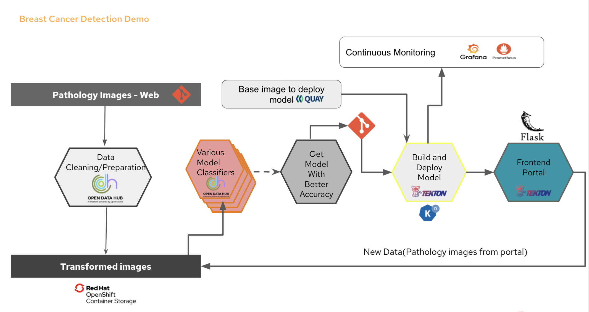

# End to End AI-ML Workflow --- Mammogram Demo
This is the Flask based frontend app to use breast cancer detection model to classify whether the uploaded pathology images are malign or benign.

Parts of this demo: 
* [Frontend portal-current repo](https://github.com/hanvitha/breastcancer_portal)
* [Model](https://github.com/hanvitha/breastcancer_detection)
* [Pipelines](https://github.com/hanvitha/breastcancer_pipelines) 





Pre-requisites: Internal RedHatters--> Skip this and provision "OpenShift 4 AI ML Workflows Demo"" on rhpds 
* Install Red Hat Openshift Serverless Operator
* Create a serviceaccount named "pipeline" to run the pipelines
* Optional-In order to showcase jupyter hub notebook, install OpenDataHub operator from OperatorHub


Create a project "ai-ml-demo" in Openshift. We will be using this throughout the demo.
```bash
oc new-project ai-ml-demo
```
## Model Deployment in Openshift

### Deploying using a pipeline
```bash
oc apply -f https://raw.githubusercontent.com/hanvitha/breastcancer_pipelines/master/tasks/s2i-model.yaml
oc apply -f https://raw.githubusercontent.com/hanvitha/breastcancer_pipelines/master/resources/build-image.yaml
oc apply -f https://raw.githubusercontent.com/hanvitha/breastcancer_pipelines/master/resources/build-source.yaml
oc apply -f https://raw.githubusercontent.com/hanvitha/breastcancer_pipelines/master/pipeline/deploy-pipelines.yaml
```
If you have tekton installed, run 
```bash
tkn pipeline start bcd --serviceaccount='pipeline' --showlog
```
Click enter to choose default options till the pipeline runs

You can also go to pipeline in Openshift console and Start Run with all defaults

## Frontend app Installation in Openshift
### From Openshift console:
* In Openshift Console, Go to Developer perspective
* Make sure you are in ai-ml-demo project
* Click on +Add
* Choose from Git
* Copy paste the current [repo](https://github.com/hanvitha/breastcancer_portal.git) 
* Keep everything default and click Create

### OR from CLI
```bash 
oc new-app -n ai-ml-demo https://github.com/hanvitha/breastcancer_portal.git
oc expose service/breastcancerportal
```

UI should look like this::


## Optional - Attach storage
You can connect your RedHat container storage to the frontend app here so that the images uploaded to test will be saved.

## Adding Monitoring and Metrics
### Connecting Prometheus  
```bash
oc new-app prom/prometheus
oc expose service/prometheus

curl https://raw.githubusercontent.com/hanvitha/breastcancer_detection/master/mlworkflows/prometheus.yaml -o prometheus.yaml
oc create configmap prom --from-file=prometheus.yaml
oc set volume deployment/prometheus --add -t configmap --configmap-name=prom -m /etc/prometheus/prometheus.yml --sub-path=prometheus.yaml

oc rollout status -w deployment/prometheus
```
Add sum(pipeline_predictions_total) by (app, value) to monitoring metrics


### Connecting Grafana  
```bash
oc new-app grafana/grafana
oc expose service/grafana
```
Add prometheus dashboard in grafana using:
```bash
http://prometheus.ai-ml-demo:9090
```
Add sum(pipeline_predictions_total) by (app, value) to monitoring metrics and create your own dashboard.

Sample board to use : https://raw.githubusercontent.com/hanvitha/breastcancer_detection/master/Breast%20Cancer%20Model%20Metrics-grafana_dashboard.json


# Working it all together
* In order to test the app is all up and running, download images from [testimages](testimages/) folder and download the images(you can clone the repo if needed)
* Our model is around 70% accurate so it can detect malignancy most of the times but not always.
* From UI, upload/drop the test image. and click on Get Prediction. 
* You will see the prediction below the button. It can take a couple of seconds as it needs to process the image. 
* Image names with postfix _0 are benign -absent of cancer cells, and _1 are malign for your reference. You can change names if you like.
* You can see how your model is working from grafana dashboard.


Thanks for going through my demo.This is purely my personal demo created to show Opensource value to my customers.
Please reach out to me on my [LinkedIn](linkedin.com/in/hanvitha/)
